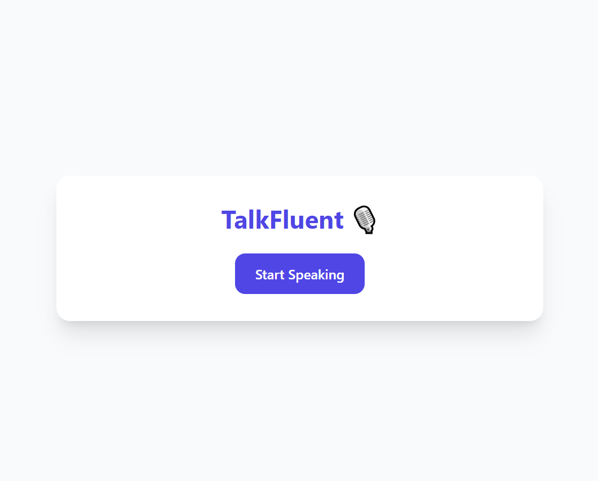
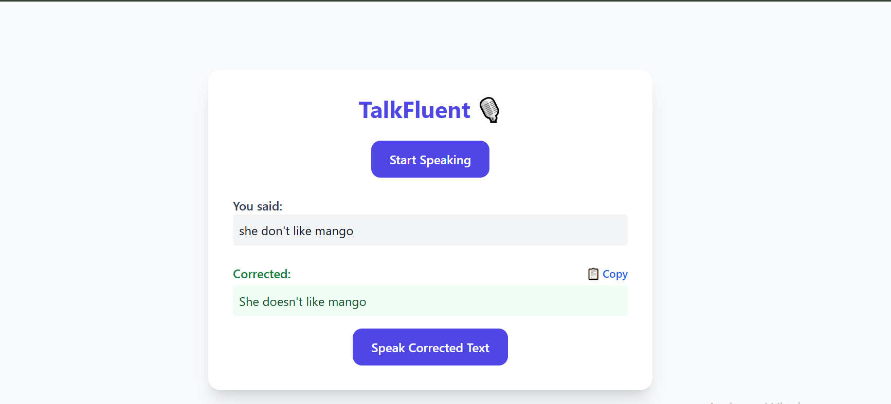

# 🗣️ TalkFluent

> **TalkFluent** is an AI-powered English speaking practice tool that helps users improve fluency, grammar, and confidence through real-time speech recognition and intelligent feedback.

🌐 **Live Demo:** [https://talkfluent.tutorazzi.com](https://talkfluent.tutorazzi.com)

---

## 🚀 Features

- 🎤 **Speech Recognition** – Speak naturally and get real-time transcriptions
- 🧠 **AI Grammar Feedback** – Corrects sentences with grammar-aware suggestions
- 🔊 **Text-to-Speech** – Hear how sentences should sound natively
- 💬 **Conversation Prompts** – Practice speaking with dynamic prompts
- 📈 **Progress Insights** *(Coming soon)* – Fluency, accuracy & improvement tracking

---

## 🛠️ Tech Stack

| Frontend | Backend | AI & NLP | Infrastructure |
|----------|---------|----------|----------------|
| React (Web App) | Node.js, Express.js | OpenAI API, Web Speech API | Docker, Docker Compose, NGINX |
| HTML5 / CSS3 / JS | REST APIs | LanguageTool / Custom Grammar Rules | Firebase Auth, Cloud Storage |

---

## 📸 Screenshots

### 🏠 Homepage


### 🎤 Speaking Practice



## 🐳 Dockerized Setup

### 🧩 Prerequisites
- Docker
- Docker Compose

### 🚀 Run the App

```bash
# Clone the repository
git clone https://github.com/fullstackabhi-Js/talkfluent.git
cd talkfluent

# Run Locally
cd client && npm start
cd service && node index.js

# Build and run using Docker Compose
docker-compose up --build
